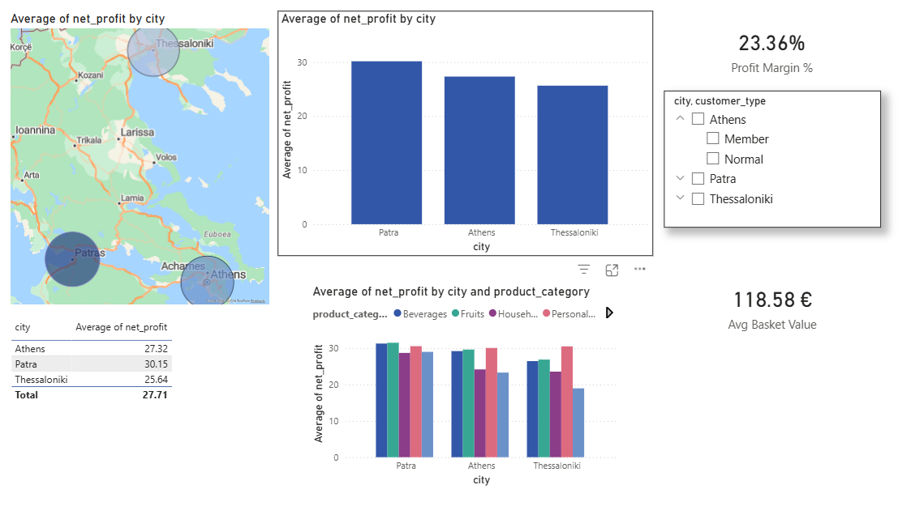

# Retail & Loyalty Analytics Dashboard

## Project Overview
Στόχος είναι η ανάλυση της κερδοφορίας ανά περιοχή και η αξιολόγηση προγράμματος membership. 
Αυτό το project απαντά σε τρία κρίσιμα ερωτήματα:

1. Πώς επηρεάζουν οι πόντοι (Reward Points) το συνολικό κέρδος;

2. Ποιο είναι το Profit Margin % των "Members" (AB Plus) έναντι των "Normal" πελατών;

3. Ποιες περιοχές (Athens, Thessaloniki, Patra) παρουσιάζουν ευκαιρίες για ανάπτυξη;

## Tech Stack & Workflow
1. **Excel/Pandas:** Καθαρισμός και Localization (Αθήνα, Θεσσαλονίκη, Πάτρα).
2. **Python:** Έλεγχος ποιότητας δεδομένων και μετατροπή σε SQL περιβάλλον.
3. **Power BI:** Δημιουργία Executive Dashboard με DAX Measures (Profit Margin %).

## Key Business Insights
Loyalty Efficiency: Οι πελάτες στην Πάτρα έχουν $19\%$ υψηλότερη κερδοφορία, η οποία συνδέεται άμεσα με τη χρήση membership (Avg Points: $6.9$).

Promotion Impact: Τα καλάθια που περιλαμβάνουν προσφορές έχουν μέσο κέρδος €42, σε αντίθεση με τα €14 των απλών αγορών, αποδεικνύοντας ότι τα promotions λειτουργούν ως "Profit Magnets".

Category Analysis: Η κατηγορία Personal Care εμφανίζει το καλύτερο Profit Margin %, υποδεικνύοντας χώρο για περαιτέρω επενδύσεις σε ιδιωτική ετικέτα.

## Δομή Αρχείων
- `/data`: Το εμπλουτισμένο dataset.
- `/scripts`: Python κώδικας για SQL ανάλυση.
- `/dashboard`: Το αρχείο Power BI (.pbix).

## Screenshots
